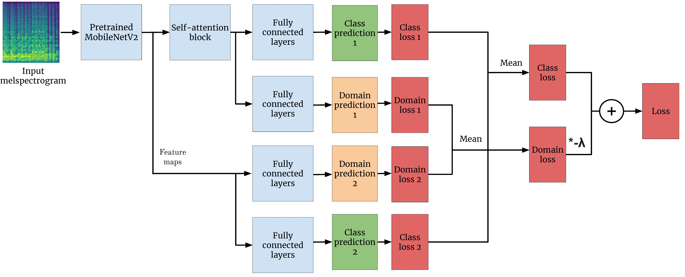

# Solution to the "MediaEval - The 2019 Emotion and Themes in Music using Jamendo" task with Domain Adversarial Training

This repository contains [Manoj Sukhavasi's](https://github.com/manojsukhavasi) and [Sainath Adapa's](https://github.com/sainathadapa) solution to the 2019 Emotion and Themes in Music using Jamendo task, part of [MediaEval 2019](http://www.multimediaeval.org/mediaeval2019/). Submission 2 has been adapted to allow for domain adversarial training.

## Introduction

For details about the task, please follow the links:
- http://www.multimediaeval.org/mediaeval2019/music/
- https://multimediaeval.github.io/2019-Emotion-and-Theme-Recognition-in-Music-Task/

The original solution is described in the [report](MediaEval_19_paper_35.pdf).

## Domain Adversarial Training

The model for Submission 2 has been adapted to allow for [domain adversarial training](https://arxiv.org/pdf/1505.07818.pdf). Domain adversarial training \cite{domain_adversarial} is a technique that aims to help the classifier learn invariant features between source (training) and target (test) domains. This is achieved by splitting the network into a feature extractor and a label predictor. A domain classifier is also included, which takes features as input, and returns a binary classification as to whether the features (and therefore input data) are from the source domain or target domain. 
 The entire network is penalised if the domain classifier becomes too good at predicting the domain of the features. This, therefore, encourages the network to learn features that a classifier struggles to tell which domain they are from - i.e. it encourages the network to learn domain invariant features
 
 The Figure below shows a schematic of how the model was adapted to use domain adversarial training.
 
 

## Citing and license
The original solution was developed by:

- [Manoj Sukhavasi](https://github.com/manojsukhavasi)
- [Sainath Adapa](https://github.com/sainathadapa)

This work is licensed under the [MIT License](LICENSE).
